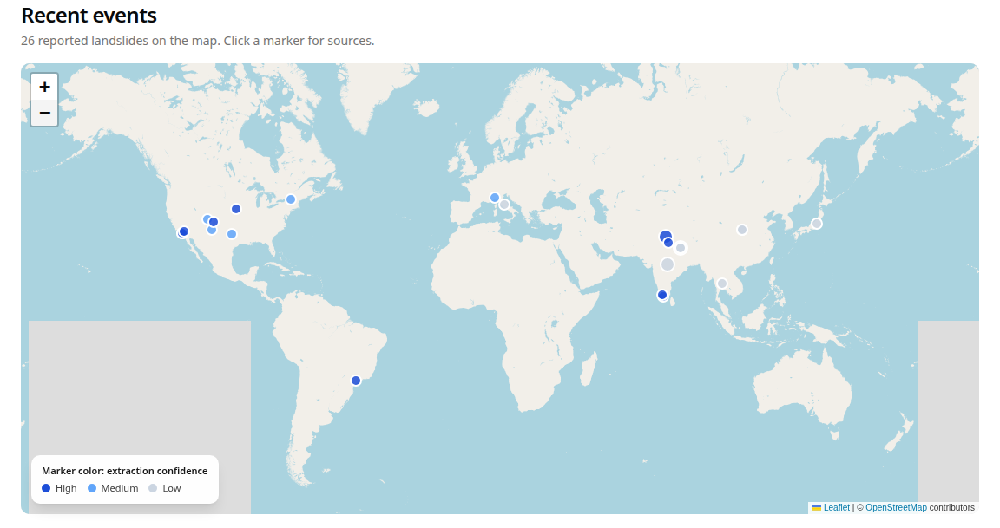
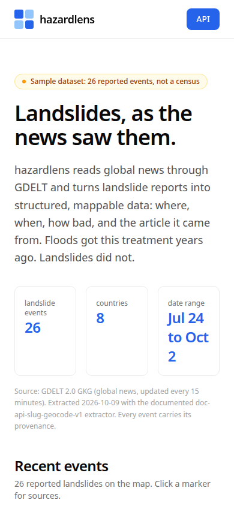
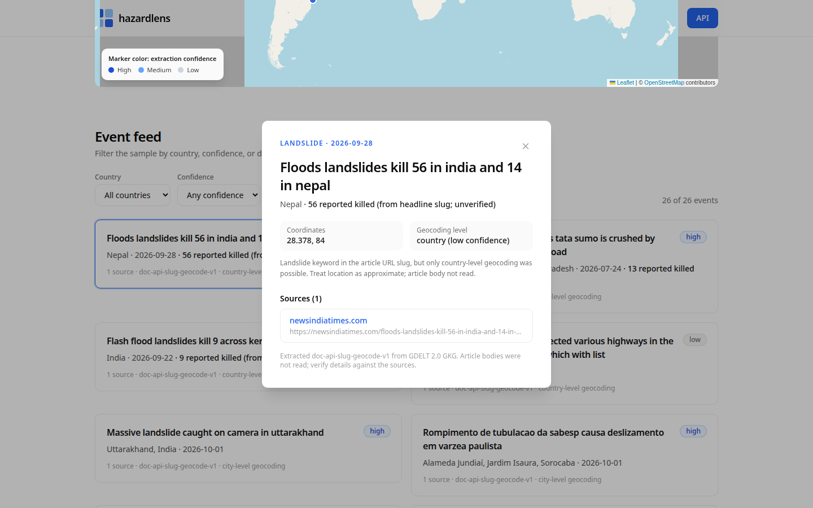
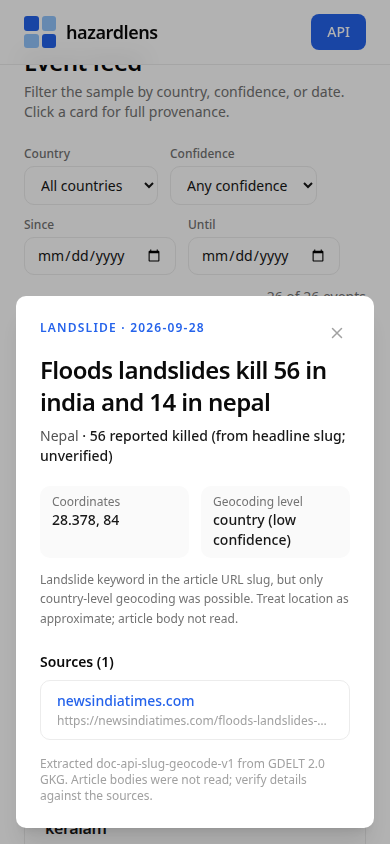

# hazardlens

News-derived hazard event data. hazardlens turns global news into a structured, queryable open dataset of **landslide** events: where they were reported, when, how bad, and the article each record came from.

Google's Groundsource did this for floods. Landslides never got the treatment. hazardlens is the same recipe pointed at the gap: GDELT 2.0 watches global news in 65+ languages and updates every 15 minutes; the pipeline extracts landslide reports into versioned, mappable data with provenance on every record.



## Honest labeling

This project ships a **sample dataset, not a census**. Coverage follows news coverage: under-reported regions are under-represented. No article body is fetched; matching is keyword-level on URL slugs; Nominatim geocoding of slug-derived place names can be wrong; casualty counts are unverified leads. Every event carries its extraction method, match tier, confidence, and a confidence note stating the limits. The extractor's full spec and known limits are in the method section on the site and in `scripts/build-dataset.mjs`.

## What is here

- `scripts/build-dataset.mjs`: the extraction pipeline. Queries the GDELT 2.0 DOC API (artlist mode) per landslide term, keeps articles whose URL slug contains a landslide keyword, drops election metaphors and opinion pieces, geocodes a place name per article via Nominatim (OpenStreetMap) with the story's country as hint, validates against country agreement, dedupes to events.
- `data/events-sample.json`: the sample dataset (26 events, 8 countries, 2026-07-24 to 2026-10-02, generated 2026-10-09). Regenerate with `npm run build:dataset`.
- `app/api/v1/events`: filterable REST API (`hazard`, `country`, `since`, `until`, `confidence`, `limit`, `offset`). Every response carries `sample: true`.
- `app/api/openapi.json`: OpenAPI 3.1 contract.
- The UI: world map of events, filterable feed, per-event detail with source links, method documentation, API docs.

## API quick start

```bash
curl "https://hazards.nshipyard.com/api/v1/events?hazard=landslide&country=Nepal&since=2026-01-01&limit=5"
curl "https://hazards.nshipyard.com/api/openapi.json"
```

## Configuration

No environment variables. No API keys. The app ships the sample dataset as JSON and needs nothing at runtime. The pipeline script needs outbound HTTPS to `api.gdeltproject.org` (paced 10s apart with backoff; GDELT rate-limits shared IPs) and `nominatim.openstreetmap.org` (1 request/second per usage policy).

| Task | Command |
| ---- | ------- |
| Install | `npm install` |
| Dev server | `npm run dev` |
| Lint | `npm run lint` |
| Production build | `npm run build` |
| Rebuild the sample dataset | `npm run build:dataset` |
| Product review cycle | `node scripts/review-cycle.mjs` (needs a production build on :3105) |

## Screenshots

| Desktop | Mobile |
| ------- | ------ |
|  |  |
|  |  |

## Verification

- `npm run lint`: clean.
- `npm run build`: clean.
- `scripts/review-cycle.mjs`: map markers, filters, detail modal with sources, API contract checks, desktop (1440x900) and mobile (390x844) screenshots, zero console errors.

## Author

**Richardson Dackam**

- https://x.com/richardsondx
- https://github.com/richardsondx

## License

Code: MIT. GDELT data: per GDELT terms of use. Basemap &copy; OpenStreetMap contributors.
